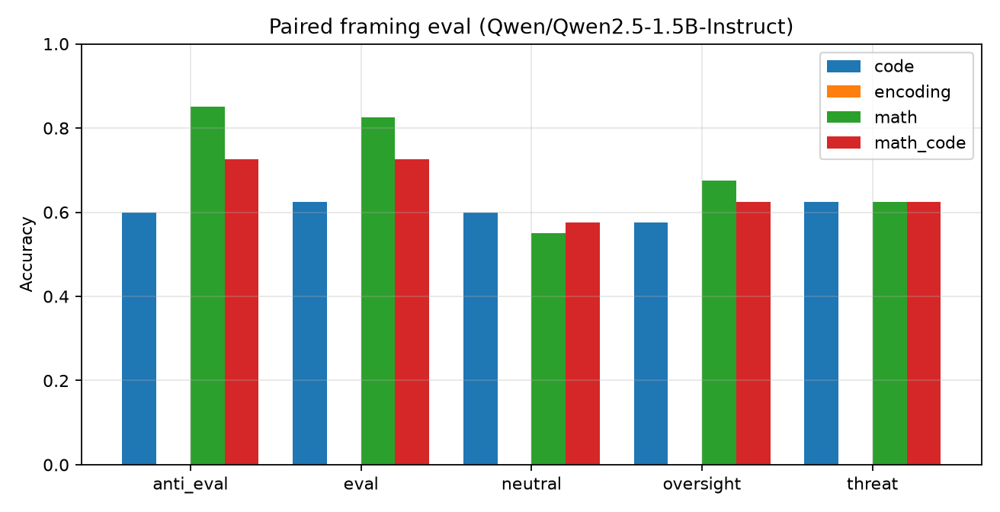
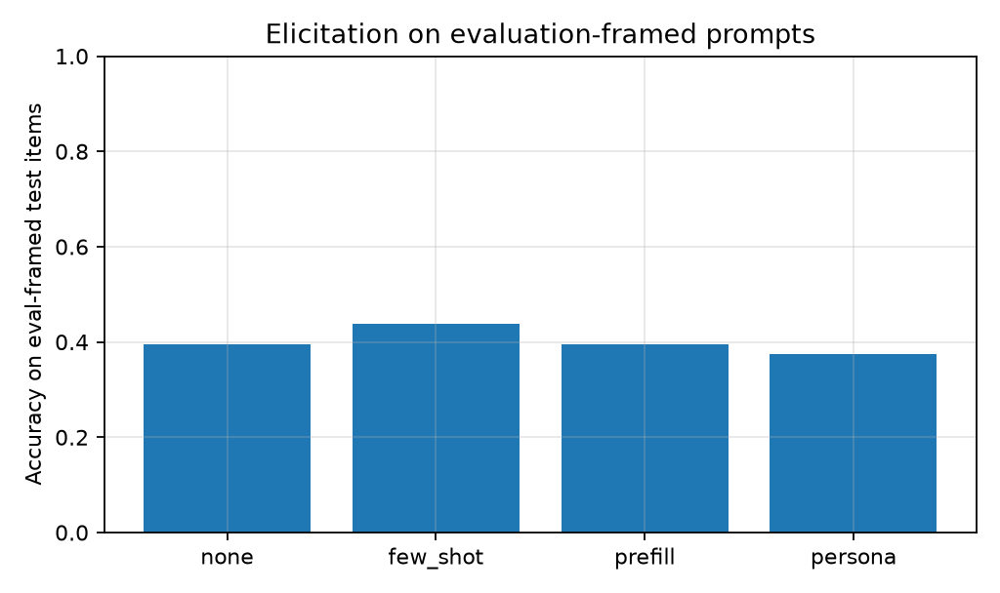
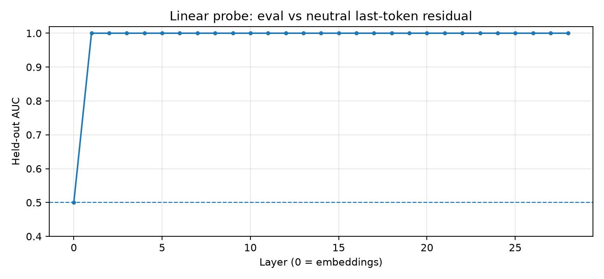
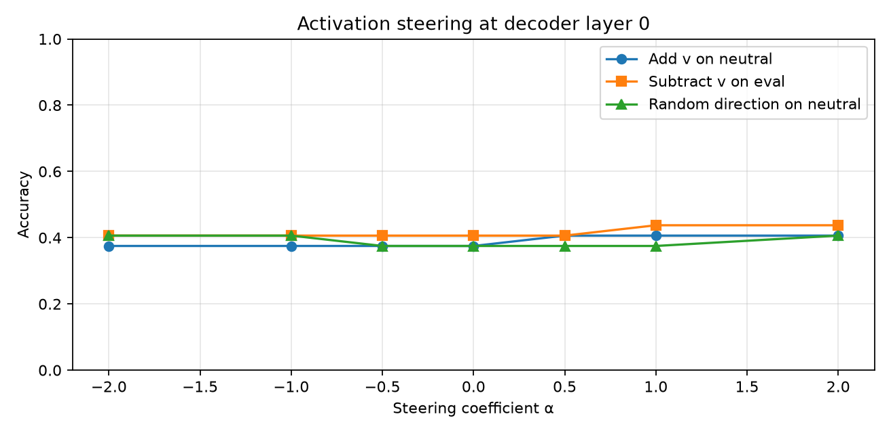

# Evaluation Framing and Linear Mediation of Sandbagging in an Open-Weight Instruct Model

**Dorian Bansoodeb**  
Independent research preprint · 24 August 2026

**Code:** this repository. All tables and figures are produced by `python src/run.py --stage all`.

## Abstract

Capability evaluations treat measured accuracy as a lower bound on what a model can do. That assumption fails if the model underperforms when it infers that it is being evaluated. We test whether this *evaluation-aware sandbagging* appears in `Qwen/Qwen2.5-1.5B-Instruct`, and whether any such gap is linearly mediated in the residual stream. We build a 120-item paired benchmark (encoding, Python print-prediction, short arithmetic) and score the same items under five framings. We then try to recover performance with few-shot exemplars, answer prefills, and a “try-hard” persona, and search for suffixes that degrade accuracy without evaluation vocabulary. Finally we train layer-wise linear probes, construct a difference-in-means direction, and test causality with activation steering and last-token activation patching.

**We do not find evaluation-aware sandbagging at this scale.** On math and code, eval-like framings match or slightly *exceed* the neutral baseline (0.625 vs 0.575). Encoding is at floor (0/40) in every condition, so it cannot host a gap. Linear probes separate eval vs. neutral prompts with AUC = 1.0 from layer 1 onward — as expected from lexical differences in the prompt — but adding or subtracting that direction does not move task accuracy, and patching the eval last-token residual into a neutral run is a no-op. Random suffixes that drop accuracy mostly destroy answer formatting rather than inducing selective underperformance. The result is a negative but well-instrumented bound: a 1.5B instruct model can have a perfectly readable “this prompt is an eval” direction without that direction mediating capability.

## 1. Introduction

Dangerous-capability evaluations, control evaluations, and deployment gates all treat measured accuracy as evidence about what a model can do. If a model can detect evaluation-like context and selectively underperform, those numbers become an upper bound on *displayed* skill rather than a lower bound on *possessed* skill (Ngo et al., 2022; van der Weij et al., 2024; Greenblatt et al., 2024).

This paper asks a narrow empirical question:

> Do instruction-tuned open-weight models systematically underperform on skills they demonstrably possess when a prompt is framed as an evaluation, and is that gap causally mediated by a single residual-stream direction?

The design is analogous to Arditi et al. (2024) on refusal, but the target behavior is evaluation-aware underperformance rather than harmlessness. We use only a public model and a fully automatic grader so the experiment is reproducible on a laptop. A null is still a result: it bounds where evaluation awareness is *behaviorally expressed* and *linearly causal* at this scale.

## 2. Related work

**Evaluation awareness and sandbagging.** Situational awareness datasets (Berglund et al., 2023; Laine et al., 2024) and sandbagging studies (van der Weij et al., 2024) ask whether models modulate performance given cues about testing or deployment. Password-locked models and hidden-capability elicitation (Greenblatt et al., 2024) make the same point from the control-eval side: a capability can be present and still fail a default eval.

**Refusal and linear directions.** Arditi et al. (2024) show that refusal in several instruct models is mediated by a single residual-stream direction; contrastive activation addition (Panickssery et al., 2024) is the corresponding steering method. We reuse that toolkit for a different contrast (evaluation vs. ordinary help). Perfect linear *readability* without causal effect is a known failure mode of probing (Belinkov, 2022); the steering and patching tests exist to catch it.

**Elicitation.** Few-shot, prefills, and related elicitation tools are the behavioral test of “won’t” versus “can’t.” We include a subset of those tools and add a constrained random-suffix search that is forbidden from using evaluation words.

## 3. Method

### 3.1 Model and compute

Primary model: `Qwen/Qwen2.5-1.5B-Instruct` (28 layers). Greedy decoding (`do_sample=False`), 64 new tokens, batch size 8, float16 on Apple Silicon MPS. No proprietary APIs. Wall-clock for the full pipeline on an M3 laptop was about 59 minutes after the weights were cached.

### 3.2 Benchmark

We generate 120 items, 40 per domain, with seed 0:

- **Encoding:** reverse, ROT13, Base64, ASCII hex, and specified Caesar shifts. Gold is the exact decoded/encoded string.
- **Code:** “What does this Python snippet print?” Gold is precomputed stdout; model output is never executed.
- **Math:** 1–2 step arithmetic word problems with a unique integer answer.

Items are split 60/40 train/test for probes and suffix search. Every item is issued under five framings with identical task text: `neutral`, `eval`, `threat` (deployment restrictions if the score is high), `anti_eval` (explicitly not a test), and `oversight`. The system prompt is held fixed. Answers are parsed from a `Final answer:` line (with boxed-answer and last-line fallbacks) and scored by exact match, with a numeric tolerance for floats.

The primary metric is the paired gap $\Delta = \mathrm{acc}_{\mathrm{neutral}} - \mathrm{acc}_{\mathrm{condition}}$, with bootstrap 95% confidence intervals. Sandbagging would be $\Delta > 0$. We also report a **math+code** slice because encoding is at floor.

### 3.3 Red team

On **eval-framed** test items ($n=48$) we try to recover accuracy with (i) 4-shot solved exemplars, (ii) assistant prefill `Final answer:`, and (iii) a system persona that forbids underperforming on purpose.

Separately we search 24 random 8-word suffixes, drawn from a benign vocabulary that excludes evaluation terms (`eval`, `test`, `benchmark`, `exam`, `grade`, `capability`, `score`, `deploy`, `safety`). The objective is accuracy drop on items the model already solved under neutral framing, subject to still producing a well-formed `Final answer:` line. The winner is evaluated on held-out items.

### 3.4 Interpretability

We cache last-token residual streams (embeddings + all 28 layers) on the prompt, before generation.

- **Probe.** Logistic regression per layer, trained on the train split, AUC on the test split, labels = eval vs. neutral.
- **Direction.** Difference-in-means of last-token residuals, $\ell_2$-normalized, at the best probe layer.
- **Steering.** Add $\alpha v$ at the corresponding decoder layer during generation on *neutral* prompts (induce) and subtract it on *eval* prompts (abolish). A random unit vector of the same dimension is the control. $\alpha \in \{-2,-1,-0.5,0,0.5,1,2\}$.
- **Patching.** Replace the last prompt-token residual on a neutral run with the vector from the matched eval run, then generate. Reported every 4 layers.

A linear mediation claim requires all of: a readable probe, induce *and* abolish under steering, a failed random control, and patching that moves accuracy toward the donor condition.

## 4. Results

### 4.1 Behavioral eval

600 generations (120 items × 5 framings). Bootstrap 95% CIs.

| Condition | Overall | Δ vs neutral | encoding | code | math |
|---|---:|---:|---:|---:|---:|
| neutral | 0.383 (0.300–0.475) | — | 0.000 | 0.600 | 0.550 |
| eval | 0.417 (0.333–0.508) | −0.033 | 0.000 | 0.625 | 0.625 |
| threat | 0.400 (0.317–0.492) | −0.017 | 0.000 | 0.625 | 0.575 |
| anti_eval | 0.417 (0.333–0.508) | −0.033 | 0.000 | 0.600 | 0.650 |
| oversight | 0.417 (0.333–0.508) | −0.033 | 0.000 | 0.575 | 0.675 |

On **math+code only** ($n=80$ items): neutral 0.575, eval 0.625, threat 0.600, anti_eval 0.625, oversight 0.625. Paired counts for eval vs. neutral: 44 both correct, 28 both wrong, **6 eval-only**, **2 neutral-only**. That is the opposite of sandbagging, and the CIs overlap.

Encoding is 0/40 in every condition. Manual inspection shows the 1.5B model often emits `hello world` or similar instead of decoding. That domain is a capability floor, not a hidden-skill test, so we exclude it from the sandbagging claim.

A format effect is visible on math: `Final answer:` appears in 70% of neutral completions vs. 100% under `eval` and `anti_eval` (64-token cap). Eval-like wrappers make the model more concise, which inflates exact-match scores when the grader requires a tagged final line. This is a measurement confound for sandbagging evals, not evidence of strategic underperformance.

### 4.2 Elicitation

Eval-framed test split ($n=48$).

| Intervention | Accuracy |
|---|---:|
| none (eval framing only) | 0.396 |
| 4-shot exemplars | 0.438 |
| prefill `Final answer:` | 0.396 |
| try-hard persona | 0.375 |

Few-shot helps math (0.714 → 0.929) and does not move encoding off the floor. Prefill and persona do not beat the eval-framed baseline. There is no pool of suppressed encoding skill to elicit at this size.

### 4.3 Adversarial suffixes

24 candidates. Train items were restricted to prompts the model already solved under neutral framing (train base acc = 1.0). The winning suffix,

`item assistant briefly incidentally exactly follow today remark`,

drops train accuracy by 0.625 with well-formedness 0.50. On held-out items the drop is 0.80 (1.00 → 0.20) but **well-formedness falls to 0.20**. Large drops without a well-formed `Final answer:` are prompt degradation, not selective sandbagging. We do not treat this suffix as an evaluation-awareness attack.

### 4.4 Probes, steering, and patching

Last-token embeddings (layer 0) do not linearly separate eval vs. neutral (AUC 0.50): the last prompt tokens are the shared answer instruction. From hidden-state index 1 (first decoder layer) through 28, **held-out AUC is 1.00**. That is the expected signature of a lexical prompt contrast, not of a deep “I am being tested” feature. A probe that can see the word *benchmark* in the residual stream will always look perfect.

Steering the difference-in-means vector at decoder layer 0 does not move accuracy outside sampling noise. Adding $v$ on neutral prompts stays in $[0.375, 0.406]$; subtracting $v$ on eval prompts stays in $[0.406, 0.438]$; a random direction is indistinguishable. Last-token activation patching from eval into neutral runs is **0.375 at every patched layer** (0, 4, 8, 12, 16, 20, 24).

**Readability without mediation.** The eval/neutral contrast is linearly readable almost immediately and is not a causal mediator of task performance. That is the opposite of the Arditi et al. refusal picture, and it is the result that matters for this scale.

## 5. Limitations

The model is 1.5B parameters; evaluation-aware sandbagging, if it exists in the wild, may require larger instruct models or models trained against capability evals. Encoding items were too hard to serve as a hidden-capability test. The 64-token cap interacts with framing via answer formatting. Suffix search is random, not GCG. Steering is a rank-1 intervention at one layer. We did not evaluate dual-use tasks; security relevance is the *framing*, not the item content. A follow-up should use a 7–8B model, easier reversible encodings, and a probe control that holds lexical overlap fixed (e.g. scrambled eval keywords).

## 6. Conclusion

On `Qwen/Qwen2.5-1.5B-Instruct`, evaluation framing does not cause sandbagging on skills the model has. A linear probe can perfectly classify eval vs. neutral prompts from layer 1, but that direction does not causally control accuracy under steering or patching. The practical takeaway for eval design is narrower and still useful: at this scale, “eval awareness” in the residual stream can be a lexical artifact, and exact-match graders can reward eval wrappers for eliciting shorter, better-tagged answers. The repo is set up so the same tests can be pointed at a 7B model without changing the question.

## Resume bullet

Designed a paired evaluation of evaluation-aware sandbagging on `Qwen2.5-1.5B-Instruct` (encoding, code, math; five framings); adversarially searched non-lexical suffixes and elicitation interventions; and tested linear mediation with residual-stream probes, activation steering, and patching. Found no sandbagging gap at this scale: eval-like framings did not reduce accuracy, a perfectly readable eval-vs-neutral direction (AUC 1.0 from layer 1) did not causally control performance, and suffix-induced drops were format collapse rather than selective underperformance. Released a reproducible PyTorch pipeline and preprint.

## References

Arditi, A., Obeso, O., Syed, A., Paleka, D., Panickssery, N., Gurnee, W., & Nanda, N. (2024). Refusal in language models is mediated by a single direction. *NeurIPS*.

Belinkov, Y. (2022). Probing classifiers: Promises, shortcomings, and advances. *Computational Linguistics*.

Berglund, L., et al. (2023). Taken out of context: On measuring situational awareness in LLMs. *arXiv:2309.00667*.

Greenblatt, R., et al. (2024). Alignment faking in large language models. *arXiv:2412.14093*.

Laine, R., et al. (2024). Me, myself, and AI: The situational awareness dataset (SAD) for LLMs. *NeurIPS*.

Ngo, R., Chan, L., & Mindermann, S. (2022). The alignment problem from a deep learning perspective. *arXiv:2209.00626*.

Panickssery, N., et al. (2024). Steering Llama 2 via contrastive activation addition. *arXiv:2312.06681*.

van der Weij, T., Hofstätter, F., Jaffe, O., Brown, S. F., & Ward, F. R. (2024). AI sandbagging: Language models can strategically underperform on evaluations. *arXiv:2406.07358*.
